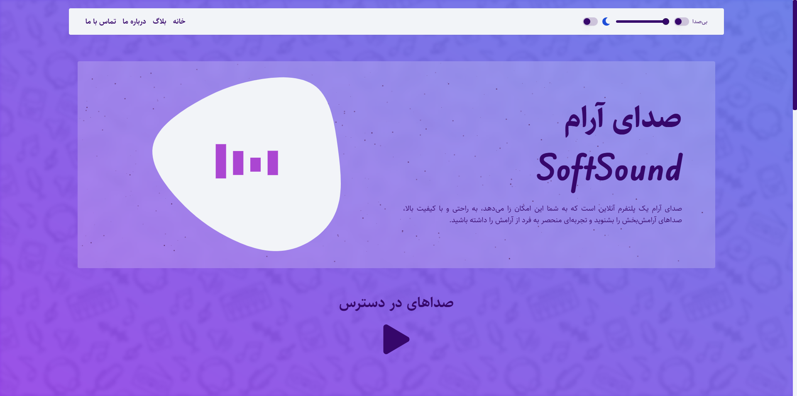
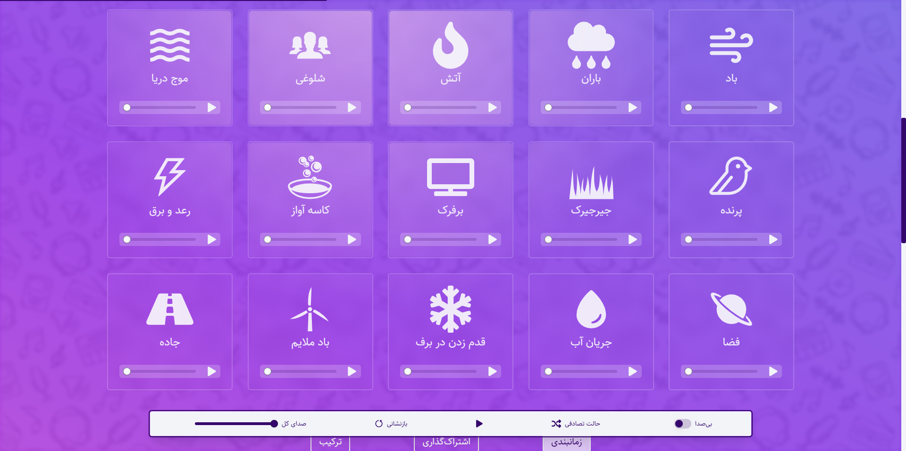
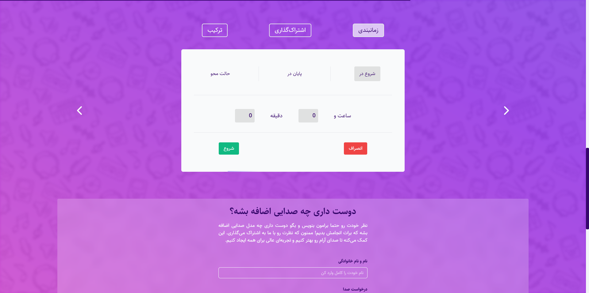
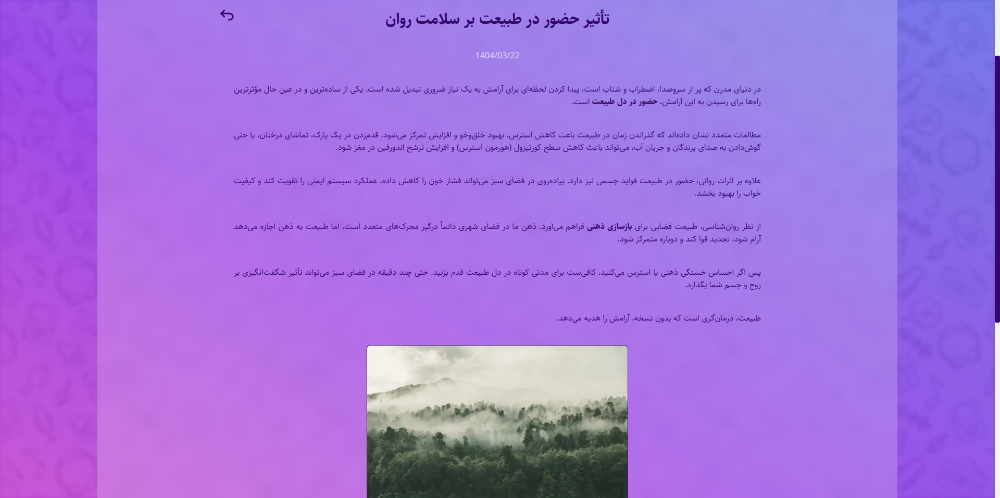
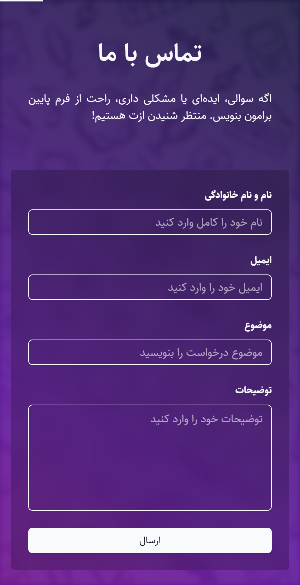
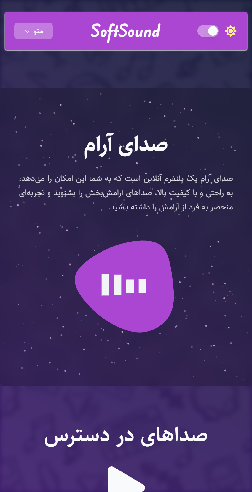

# 🔊 SoftSound — Ambient Sound Experience

> Layer relaxing sounds, build your personal mix, and find your focus.

SoftSound is an interactive ambient audio platform built for focus, sleep, and relaxation — with layered playback, volume and fade controls, and a personal mix builder.

🔗 [Visit Site](https://softsound.vercel.app) · [فارسی](./README.fa.md)

---

## 📁 Screenshots

| 🏠 Home Page | 🏠 Sound Player |
|---|---|
|  |  |

| 🎵 Mix Builder | 📝 Blog |
|---|---|
|  |  |

| 📱 Mobile View 1 | 📱 Mobile View 2 |
|---|---|
|  |  |

---

## 🧠 Tech Stack

| Layer | Technology |
|---|---|
| Framework | Next.js 14 (App Router) |
| Language | TypeScript |
| State | Redux Toolkit |
| Styling | Tailwind CSS + shadcn/ui |
| Animations | Framer Motion |
| SEO | next-sitemap |
| Deployment | Vercel |

---

## ⚡ Technical Highlights

- **Audio architecture**: Layered sound engine supporting simultaneous multi-track playback with independent volume and fade controls per channel
- **State management**: Redux Toolkit for global mix state — tracks, volumes, and playback sync across components
- **Animations**: Framer Motion for smooth transitions, sound card interactions, and ambient visual feedback
- **Accessibility**: WCAG-compliant UI — keyboard navigable, screen-reader friendly, reduced-motion respected
- **SEO**: next-sitemap integration with structured metadata for full crawlability
- **Performance**: Lighthouse 90+ via lazy-loaded audio assets, code splitting, and optimized bundle size
- **Responsive**: Mobile-first layout, fully functional across all screen sizes

---

## 📁 Project Structure

```
src/
├── app/                 # Next.js App Router routes
│   ├── page.tsx         # Main player / home
│   └── blog/            # Blog section
├── components/          # Reusable UI components
│   ├── player/          # Audio player components
│   └── ui/              # shadcn/ui base components
├── store/               # Redux Toolkit slices (mix, playback)
├── data/                # Sound track definitions (JSON)
└── public/              # Static audio and image assets
```

---

## ⚙️ Setup & Run Locally

```bash
# Clone the repository
git clone https://github.com/mostafakm78/murmur-sounds-web.git

# Navigate to project directory
cd murmur-sounds-web

# Install dependencies
npm install

# Start the development server
npm run dev
```

Open [http://localhost:3000](http://localhost:3000) in your browser.

---

## 🚀 Roadmap

### ✅ Shipped
- [x] Layered multi-track ambient playback
- [x] Per-channel volume and fade controls
- [x] Personal mix builder
- [x] Blog section
- [x] WCAG-compliant accessible UI
- [x] Mobile-first responsive design
- [x] Lighthouse 90+ performance

### 🔜 Upcoming
- [ ] Save and share custom mixes via link
- [ ] User accounts with saved mix history
- [ ] Timer — auto-stop after X minutes
- [ ] More sound categories (nature, city, white noise)

---

## 📜 License

This project is open-source under the [MIT License](LICENSE).

---

## 🧑‍💻 Author

**Mostafa Kamari** — Frontend Developer · React & Next.js

[GitHub](https://github.com/mostafakm78) · [LinkedIn](https://linkedin.com/in/mostafa-kamari) · [Portfolio](https://portfolio-immostafakamari.vercel.app)
